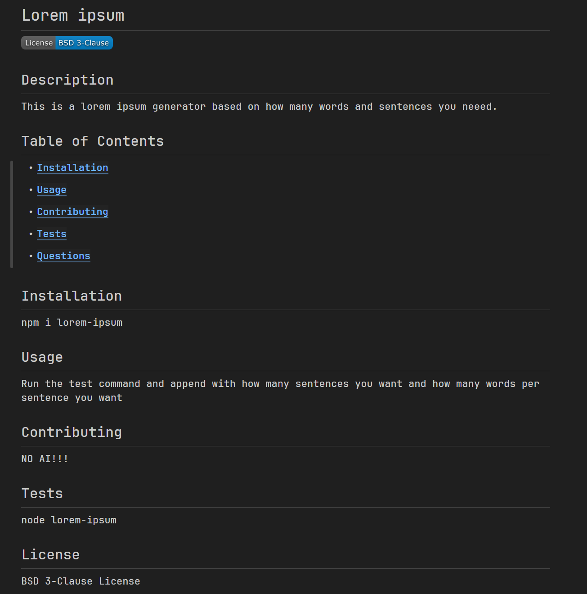
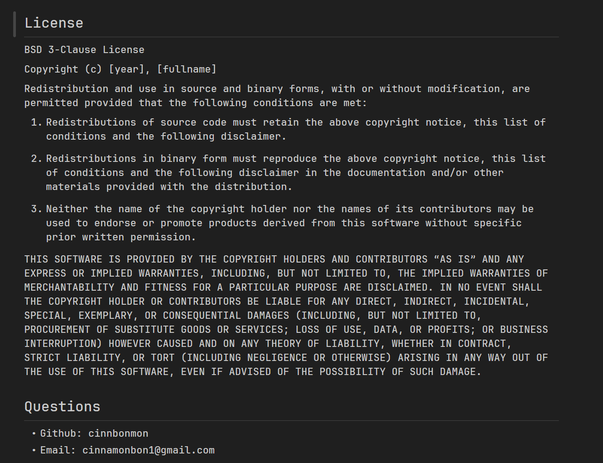

# Markdown Generator


## Description

This is a generator to help with making READMEs a whole lot easier. All that is required is to make sure you have a terminal with nodejs installed and have all the files cloned and then make sure you are in the Development folder in your terminal. It produces a README.md that you then can use for any git repo you desire!

## Table of Contents
- [Installation](#installation)
- [Usage](#usage)
- [Contributing](#contributing)
- [Tests](#test)

- [Questions](#questions)

## Installation

```
git clone https://github.com/Cinnabonmon/Markdown-generator.git
```

## Usage

Be in a terminal in the cloned folder. Make sure you then cd into Development. Then use th test command in that folder and it will prompt you for all the things you would like to add.

## Contributing

You can fork this and make it better or just do a pull request with a fix or feature that will benefit this mini project

## Tests

```
cd Development/
node index.js
```

## ScreenShots


---



## Questions

- Github: Cinnabonmon
- Email: Cinnamonbon1@gmail.com
